# Projektdokumentation für Chess

## Einleitung

Dieses Repository besteht aus zwei ausführbaren Systemen, die unterschiedliche Teile desselben Problems lösen. `ChessApplication` ist der Desktop-Client. Er enthält die lokale Schachregel-Engine, die Avalonia-Benutzeroberfläche, die Speicher- und Ladefunktion, einen kleinen KI-Gegner und den Online-Client, der mit dem Multiplayer-Server spricht. `MultiplayerServer` ist das Backend für das Onlinespiel. Es stellt HTTP-Endpunkte für Aktionen im Match-Lebenszyklus bereit, einen SignalR-Hub für Echtzeitupdates und einen In-Memory-Match-Service, der bei Multiplayer-Partien als autoritative Quelle der Wahrheit fungiert.

Obwohl beide Seiten mit Schachzuständen arbeiten, teilen sie sich nicht dasselbe Laufzeitmodell. Der Client verwendet ein unveränderliches Domänenmodell rund um `GameState`, `Move`, `Piece` und `Square`. Der Server hält dagegen einen `MatchState` im Speicher, mit einem veränderlichen `char[]`-Brett und separaten Metadaten für Rochaderechte, En-passant, Verbindungsstatus und Reconnect-Zeitfenster. Diese Trennung ist eine wichtige Entwurfsentscheidung. Der Client ist auf Darstellung, lokale Analyse und Benutzerinteraktion optimiert, während der Server auf autoritative Multiplayer-Zustandsverwaltung und sichere Transportlogik ausgelegt ist.

## Architekturübersicht

Bevor die einzelnen Subsysteme im Detail betrachtet werden, hilft ein gemeinsames Übersichtsbild. Das folgende Diagramm zeigt, wie die wichtigsten Bereiche zusammenspielen. Auf der linken Seite steht der Desktop-Client mit seiner Benutzeroberfläche, den lokalen Anwendungsdiensten, der Regel-Engine, der KI und der Persistenz. Auf der rechten Seite steht der Multiplayer-Server, der HTTP-Aufrufe und Echtzeitereignisse entgegennimmt und die autoritative Match-Verwaltung ausführt. Die lokale Persistenz bleibt bewusst clientseitig, während Online-Partien über HTTP und SignalR mit dem Server synchronisiert werden.

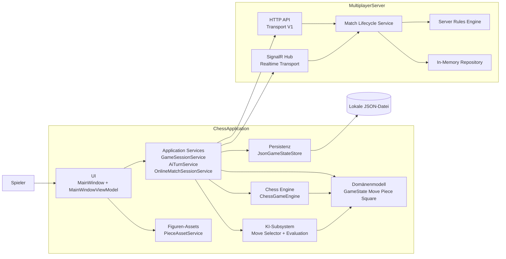

## Repository-Struktur

Auf hoher Ebene trennt das Repository lokale Spielbelange von der Online-Match-Verwaltung. Der Client ist in `Domain`, `Engine`, `Application`, `AI`, `Persistence`, `UI` und `Online` gegliedert. Der Server ist in `Application/Matches`, `Transport/V1`, `Hubs/V1` und `Contracts/V1` organisiert. Tests liegen neben beiden Produkten und decken Regelwerk, UI-Koordinatoren, Persistenz, KI-Verhalten, Onlinesynchronisation und Server-Transportverträge ab.

Die Startup-Komposition bestätigt diese Trennung. `ChessApplication/App.axaml.cs` verdrahtet manuell `ChessGameEngine`, `JsonGameStateStore`, `GameSessionService`, die KI-Services, HTTP- und SignalR-Clients, einen `OnlineMatchSessionService` und schließlich einen `MainWindowViewModel`, der `MainWindow` zugewiesen wird. `MultiplayerServer/Program.cs` konfiguriert ASP.NET Core, registriert den In-Memory-Match-Lifecycle-Service samt seiner Kollaboratoren, mappt die HTTP-Endpunkte und stellt den SignalR-Hub bereit.

## Zentrales Domänenmodell des Clients

Das Domänenmodell des Clients ist bewusst kompakt gehalten. `GameState` enthält den vollständigen lokalen Spiel-Snapshot, also das Brett, die am Zug befindliche Seite, Rochaderechte, das En-passant-Feld, Uhren, Spielstatus, Zugverlauf und eine von der Persistenz verwendete Schemaversion. `Move` ist eine unveränderliche Beschreibung eines Zuges, inklusive optionalem Schlagzug, Rochade, En-passant und Umwandlung. `Piece`, `PiecePlacement` und `Square` bilden das minimale Vokabular, das der Rest des Clients verwendet.

Dieses Modell ist wichtig, weil nahezu jedes Client-Subsystem davon abhängt. Die Engine transformiert es, die Persistenz serialisiert es, die KI bewertet es und die UI projiziert es in sichtbaren Zustand. Da die Record-Typen unveränderlich oder faktisch unveränderlich sind, erzeugen die meisten Operationen einen neuen Snapshot, anstatt den aktuellen Zustand direkt zu verändern. Das macht die Zustandsübergänge leichter nachvollziehbar und vereinfacht die Tests.

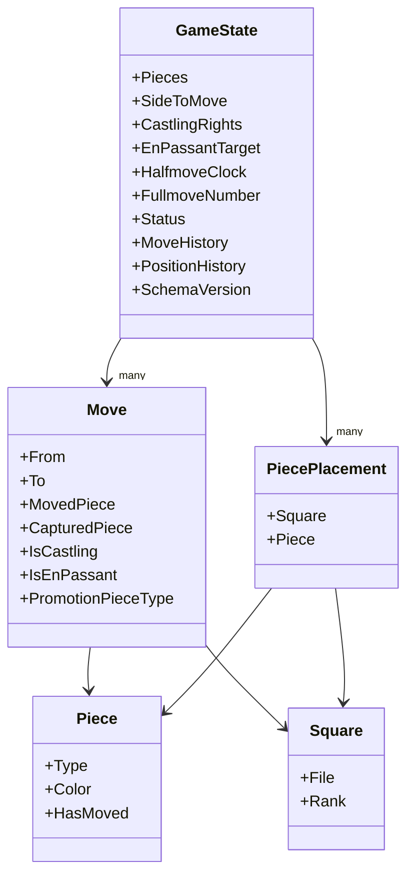

## Schach-Engine

Die lokale Regel-Engine lebt in `ChessApplication/Engine` und ist um `ChessGameEngine` herum aufgebaut. Der öffentliche Vertrag der Engine ist `IGameEngine`, doch die Implementierung ist bewusst aus kleineren Kollaboratoren zusammengesetzt, anstatt alle Regel-Logik in einer einzigen Klasse zu bündeln. `ChessGameEngine` ist die Fassade. Sie erzeugt die Startposition, fragt legale Züge ab, validiert vorgeschlagene Züge, wendet akzeptierte Züge an und beantwortet Schach-Abfragen. Intern baut sie aus dem aktuellen `GameState` ein Brett-Dictionary und delegiert die eigentliche Arbeit an vier gezielte Hilfskomponenten.

`ChessMoveGenerator` erzeugt pseudo-legale und legale Züge. Er kennt die Bewegungsregeln aller Figuren, behandelt Umwandlungen, prüft Rochade-Voraussetzungen und filtert Züge heraus, die den eigenen König im Schach lassen. `ChessAttackDetector` beantwortet, ob ein Feld angegriffen ist und ob ein Zug den König freilegt. `ChessMoveApplication` wendet die strukturellen Auswirkungen eines legalen Zuges auf ein Brett an, einschließlich Turmbewegung bei Rochaden, Bauernentfernung bei En-passant, Aktualisierung der Rochaderechte und Auflösung von Umwandlungen. `ChessStateTransitionService` verwandelt einen legalen Zug in den nächsten unveränderlichen `GameState`, aktualisiert Uhren und Historien und fragt danach `ChessGameStatusEvaluator`, ob die Partie noch läuft, remis ist oder per Matt entschieden wurde.

Diese Aufteilung hält die Engine lesbar. Zugerzeugung, Zuganwendung, Angriffserkennung und Statusevaluierung sind getrennte Verantwortlichkeiten. Sie erklärt auch, warum die Tests im Client so granular sind. Es gibt gezielte Tests für Zugerzeugung, Sonderzüge, Zustandsübergänge, Engine-Kollaboratoren und Spielstatus-Erkennung.

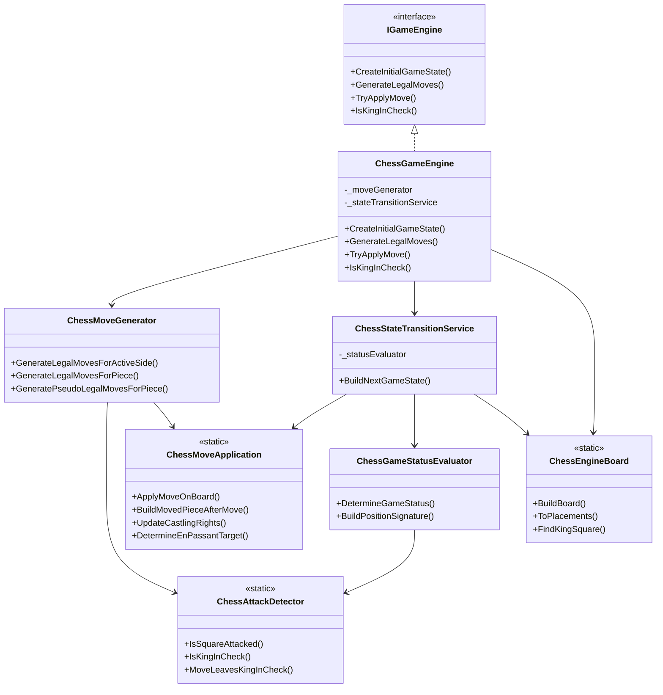

### Wie lokale Zugausführung funktioniert

Ein lokaler Zug beginnt als Klick oder Tastatureingabe in der UI, aber die entscheidende Logik liegt in der Engine. Die UI fragt bei `GameSessionService` nach legalen Zügen von einem ausgewählten Feld. Dieser Service leitet die Anfrage an `IGameEngine.GenerateLegalMoves` weiter. Wenn der Benutzer den Zug bestätigt, ruft `GameSessionService.TryMakeMove` die Methode `IGameEngine.TryApplyMove` auf. `ChessGameEngine` verwirft zuerst Züge, die von einem leeren Feld starten, der gegnerischen Seite gehören, gegen Umwandlungsregeln verstoßen oder nicht in der Menge legaler Züge enthalten sind. Ist der Zug legal, erzeugt `ChessStateTransitionService` einen neuen `GameState`, hängt den Zug an die Historie an, aktualisiert die Uhren, speichert Positionssignaturen für die Wiederholungserkennung und berechnet den neuen Spielstatus.

Deshalb kann der Client einen natürlichen lokalen Spielablauf anbieten. Die UI muss nicht wissen, wie Rochade oder Stellungswiederholung intern umgesetzt sind. Sie muss nur wissen, wie der aktuelle Zustand aussieht und welche Züge von einem ausgewählten Feld aus legal sind.

## Anwendungsservices

Die Anwendungsschicht ist bewusst schlank gehalten. `GameSessionService` besitzt den aktuellen lokalen `GameState` und stellt der UI eine stabile Grenze zur Verfügung. Er startet neue Partien, fragt legale Züge im aktuellen Zustand ab, versucht Züge auszuführen und delegiert Speichern und Laden an die Persistenzschicht. `AiTurnService` ist ein weiterer kleiner Orchestrator. Er prüft, ob die KI ziehen darf, lässt den Selektor in einem Hintergrund-Task laufen, verifiziert, dass sich der Spielzustand während der Berechnung nicht verändert hat, und übergibt den ausgewählten Zug dann über `IGameSessionService`.

Diese Schicht ist nützlich, weil die UI dadurch nicht direkt mit Engine oder Dateisystem sprechen muss. Das View-Model darf Benutzerabsichten ausdrücken, während die Application Services entscheiden, wie diese Absichten gegenüber Engine- und Speicher-Abhängigkeiten ausgeführt werden.

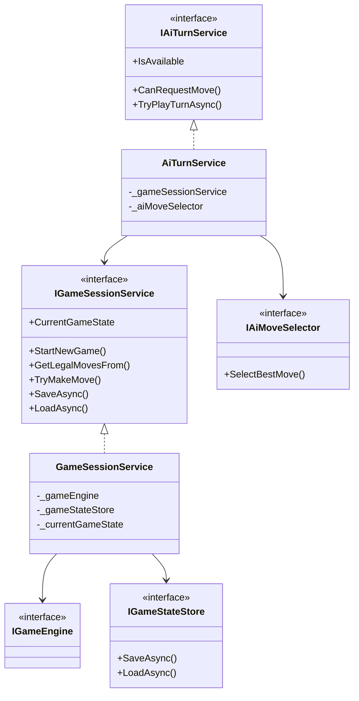

## KI-Subsystem

Die KI-Schicht ist absichtlich einfach und deterministisch. `NegamaxAiMoveSelector` durchsucht legale Züge bis zu einer Tiefe von zwei Halbzügen und wählt den Zug mit der besten Bewertung. `MaterialMobilityPositionEvaluator` bewertet eine Stellung mit einer simplen Materialsumme plus einem Mobilitätsbonus, der auf der Anzahl legaler Züge beider Seiten basiert. Endstellungen erhalten sehr große Gewinn- oder Verlustwerte, damit Matt oder Niederlage gegenüber positionellen Heuristiken dominieren.

Dieses Design macht die KI leicht nachvollziehbar und schnell genug für eine Desktop-Anwendung, ohne komplexe Suchinfrastruktur einzuführen. Es handelt sich nicht um eine wettbewerbsfähige Schachengine, sie ist aber eng mit der Client-Engine verbunden, weil sie `IGameEngine` für Zugerzeugung und Zuganwendung verwendet. Der Code begrenzt die Suchtiefe außerdem auf eins bis zwei Halbzüge, was die Laufzeit vorhersehbar macht und zu den in der UI angebotenen Tiefenoptionen passt.

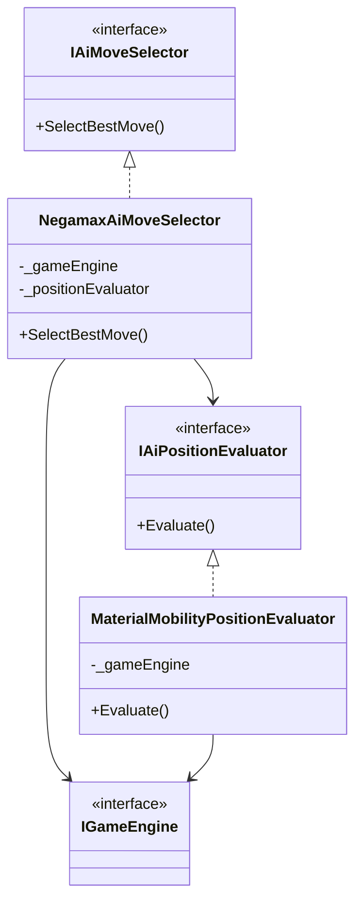

## Hauptfenster und UI-Shell

Die sichtbare Desktop-Oberfläche ist zwischen XAML und Code-Behind aufgeteilt. `MainWindow.axaml` definiert die Struktur des Fensters: das Schachbrett, Reihen- und Spaltenbeschriftungen, das Seitenpanel, KI-Steuerung, Online-Steuerung, Speichern- und Laden-Bedienelemente sowie den Zugverlauf. `MainWindow.axaml.cs` ist keine passive Hülle. Die Klasse verwaltet das responsive Layout, fängt Tastatureingaben auf Fensterebene ab und kümmert sich um das Herunterfahren. Der Code-Behind kann außerdem optional `MainWindowViewModel` und den Online-Session-Service besitzen, damit die Freigabe beim Schließen des Fensters genau einmal erfolgt.

Das ist der richtige Ort für Verantwortlichkeiten, die zum Fenster selbst gehören und nicht zum Darstellungszustand. Das Umstellen von Zwei-Spalten-Layout auf gestapeltes Layout, das Anbringen von Tasten-Handlern auf Tunnel-Ebene und das bestmögliche asynchrone Herunterfahren hängen direkt vom Avalonia-Fensterlebenszyklus ab. Diese Themen sollten nicht im View-Model leben.

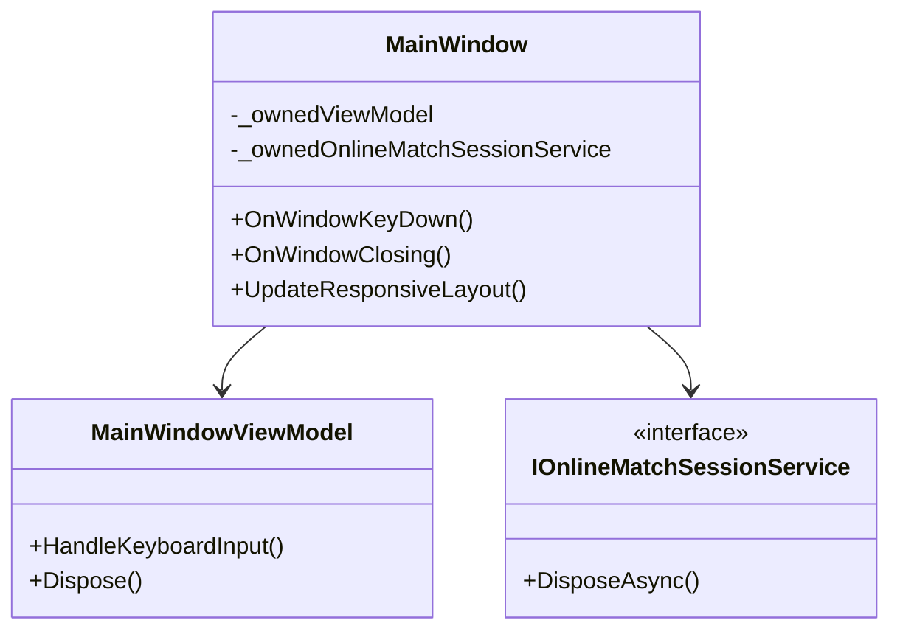

## View-Model und UI-Koordination

`MainWindowViewModel` ist der zentrale Präsentationskoordinator des Clients. Er stellt die Brettfelder, Statustexte, Feedbacktexte, Zughistorie, KI-Optionen, Online-Kommandos, den Persistenzpfad und die von XAML konsumierten Command-Objekte bereit. Außerdem hört er auf Ereignisse der Online-Session und überführt diese Updates zurück auf den UI-Thread, wenn SignalR-Callbacks auf Hintergrundthreads eintreffen.

Das wichtige Detail ist, dass das View-Model nicht jede Interaktionsregel inline enthält. Es delegiert an mehrere fokussierte UI-Services. `MainWindowLocalPlayCoordinator` behandelt Feldauswahl und lokale Zugausführung. `MainWindowOnlinePlayCoordinator` behandelt Erstellen, Beitreten, Verlassen, Resync und das Absenden von Online-Zügen. `MainWindowPersistenceCoordinator` besitzt den Speichern- und Laden-Workflow, einschließlich der Regel, dass lokale Dateien während eines aktiven Online-Matches deaktiviert sind. `MainWindowAiTurnCoordinator` verwaltet asynchrones Planen und Abbrechen von KI-Zügen. `MainWindowSelectionState` verfolgt ausgewählte Felder, legale Zielfelder, Tastaturfokus und Hervorhebungsregeln. `MainWindowKeyboardNavigator` übersetzt Tastendrücke in Navigationsaktionen. `MainWindowTextFormatter` erzeugt benutzerseitige Texte und die Notation für den Zugverlauf.

Das Ergebnis ist ein View-Model, das zwar groß, aber nicht monolithisch ist. Es fungiert als Integrationspunkt, der Brett, Koordinatoren, Application Services und Online-Session-Zustand zu einem einzigen Avalonia-seitigen Objekt verbindet.

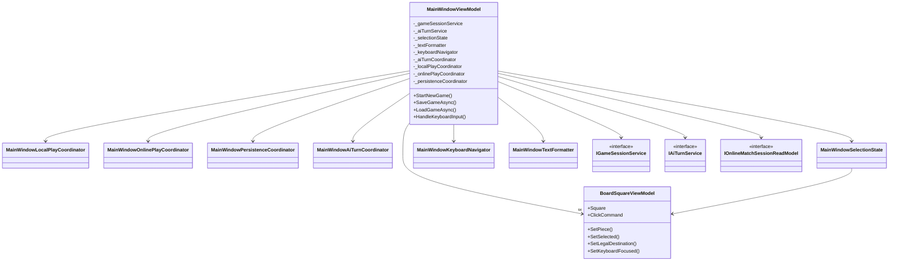

### Brettdarstellung und Kommandos

Jedes sichtbare Brettfeld wird durch `BoardSquareViewModel` repräsentiert. Diese Klasse ist für Darstellungszustände verantwortlich, etwa helle und dunkle Feldfarbe, Auswahlstatus, Fokusrahmen, Indikator für legale Zielfelder, Hervorhebung des letzten Zuges, Figurenbild und eine screenreaderfreundliche Feldbeschreibung. Jedes Feld besitzt ein `AsyncRelayCommand`, sodass sowohl lokale als auch Online-Züge asynchron abgesendet werden können, ohne den UI-Thread zu blockieren. Das Panel für den Zugverlauf verwendet `MoveHistoryEntryViewModel`, das Notationstext und deterministische Figuren-Icons enthält.

Diese Präsentationsschicht ist ein gutes Beispiel für das Gleichgewicht des Projekts zwischen einfachem Datenfluss und explizitem UI-Zustand. Das Brett wird nicht neu gezeichnet, indem View-Models ersetzt werden. Stattdessen aktualisiert `MainWindowViewModel` die vorhandenen `BoardSquareViewModel`-Instanzen mit neuen Figuren- und Hervorhebungsinformationen, sobald sich der angezeigte Zustand ändert.

## Auflösung von Figuren-Assets

Die Figurenbilder werden durch ein eigenes UI-Asset-Subsystem behandelt, anstatt direkt in den Brettfeld-View-Models geladen zu werden. `PieceAssetResolver` ist der Einstiegspunkt. Er fragt `PieceAssetUriStrategy` nach einem bevorzugten SVG-Pfad und einem Raster-Fallback, lädt das Asset über `IPieceAssetImageLoader` und speichert das Ergebnis in `PieceAssetCache`. Unterstützung zum Parsen von SVGs ist vorhanden, damit die Anwendung Vektorassets nutzen kann, wenn sie verfügbar sind, gleichzeitig aber auf PNG-Dateien zurückfallen kann, wenn das nötig ist.

Dieses Subsystem ist klein, aber es ist ein echtes Subsystem. Es zentralisiert Asset-Suche, Parsing, Caching und Fallback-Verhalten. Weil `BoardSquareViewModel` nur von `IPieceAssetResolver` abhängt, bleibt der UI-Code von Assetformaten und Cache-Details entkoppelt.

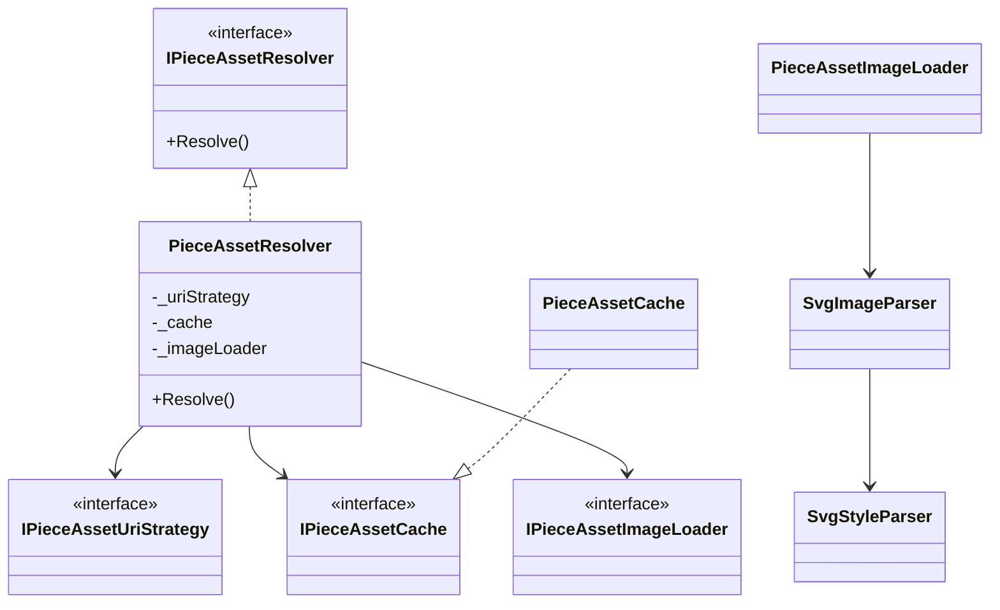

## Persistenz und Spielstände

Speichern und Laden werden in der Persistenzschicht durch `JsonGameStateStore` behandelt und dem Benutzer über `MainWindowPersistenceCoordinator` zugänglich gemacht. Das Persistenzformat ist derselbe unveränderliche `GameState`, der auch im lokalen Spiel verwendet wird. `JsonGameStateStore` serialisiert den Record-Graphen als formatiertes JSON und erzeugt bei Bedarf Verzeichnisse beim Speichern automatisch. Beim Laden validiert die Klasse Schemaversion, Enum-Werte, Uhrbereiche, Figurenplatzierungen, Einträge der Zughistorie und die Positionshistorie, sodass kaputte oder inkompatible Dateien frühzeitig mit einer verständlichen Fehlermeldung scheitern.

Der UI-Koordinator ergänzt die Workflow-Regeln um diesen Speichervorgang. Er blockiert Speichern und Laden während des Online-Spiels, trimmt den Dateipfad, meldet verständliches Feedback an das View-Model, löscht die Auswahl nach dem Laden, setzt den Tastaturfokus auf das Standardfeld zurück, aktualisiert das Brett und plant bei Bedarf erneut einen KI-Zug ein.

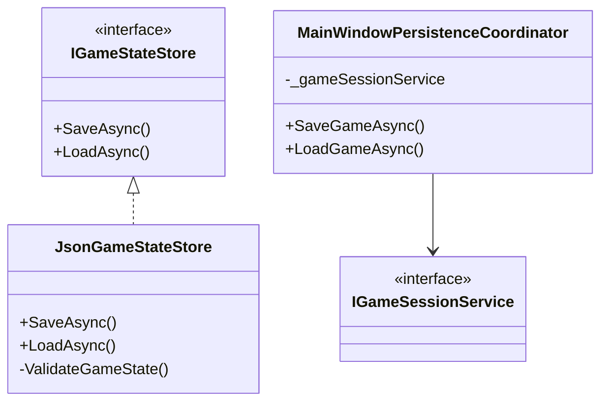

## Online-Multiplayer-Client

Der Online-Client ist einer der am stärksten geschichteten Teile von `ChessApplication`. `OnlineMatchSessionService` ist die Fassade, die von der UI verwendet wird. Er stellt Session-Zustand, Kommandos wie Erstellen, Beitreten, Zug absenden, Resync, Suspendieren und Verlassen sowie Ereignisse bereit, die dem View-Model signalisieren, wenn sich der Session-Zustand geändert hat oder dem Benutzer ein Online-Fehler angezeigt werden sollte. Intern serialisiert er Operationen über ein `SemaphoreSlim`. Das ist wichtig, weil HTTP-Anfragen, SignalR-Callbacks, Reconnect-Ereignisse und Hintergrund-Resyncs auf denselben Session-Zustand treffen.

Der Service delegiert Transportarbeit an `OnlineMatchTransportAdapter`, der domänenfreundliche Methodenaufrufe in HTTP-DTOs für `MultiplayerServerHttpClient` übersetzt. Das Management der Echtzeitverbindung delegiert er an `OnlineRealtimeLifecycleManager`, der einen SignalR-Client erzeugt, ihn mit dem Player-Token verbindet, das Match abonniert und beim initialen Connect oder Reconnect einen Resync anfordert. Die lokale Session-Speicherung delegiert er an `OnlineSessionStateCoordinator`, der Zugangsdaten, Snapshots, den gemappten Anzeige-`GameState`, die letzte Sequenznummer und den Status eines laufenden Hintergrund-Resyncs verwaltet.

`OnlineRealtimeEventReducer` ist die zentrale Korrektheitskomponente für Echtzeitupdates. Er verhindert, dass veraltete oder regressive Snapshots blind angewendet werden, und signalisiert, wenn eine Sequenzlücke bedeutet, dass der Client einen vollständigen Resync anfordern sollte. `OnlineSnapshotGameStateMapper` übersetzt autoritative Server-Snapshots in einen UI-tauglichen `GameState`. Dieses Mapping ist bewusst unvollständig. Der Online-Snapshot-Vertrag enthält Brett, Zugseite, Zugnummer, Status und Presence, aber nicht die clientseitige Zughistorie, Rochaderechte oder En-passant-Metadaten. Der gemappte Online-`GameState` eignet sich daher für Darstellung und Statusanzeige, nicht dafür, im Onlinespiel die lokale Engine als Quelle der Wahrheit zu verwenden.

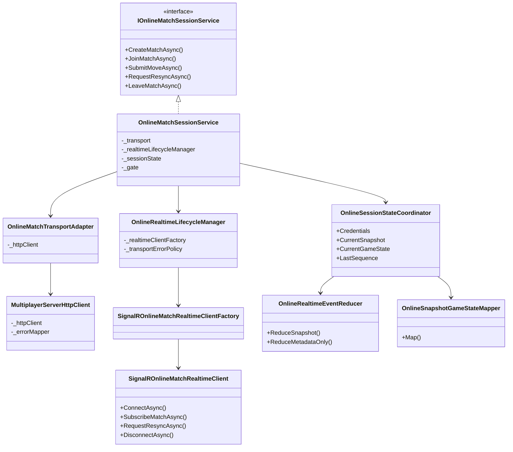

### Online-Ablauf aus Sicht der UI

Wenn der Benutzer ein Match erstellt oder einem Match beitritt, deaktiviert `MainWindowOnlinePlayCoordinator` das KI-Spiel, räumt unpassende lokale Annahmen auf und ruft `IOnlineMatchSessionCommands` auf. `OnlineMatchSessionService` setzt zunächst eine alte Session zurück, führt dann die HTTP-Operation aus, speichert die erhaltenen Zugangsdaten, lädt einen autoritativen Snapshot und baut anschließend die SignalR-Verbindung auf. Ab diesem Punkt zeigt das View-Model den Online-Spielzustand statt des lokalen Zustands aus `GameSessionService` an.

Wenn der Benutzer online einen Zug absendet, berechnet die UI die Legalität nicht lokal. Der Koordinator sendet einfach Ursprungs- und Zielfeld. Der Server akzeptiert oder verwirft den Zug. Bei Erfolg übernimmt der Session-Service den zurückgegebenen Snapshot und löst `SessionStateChanged` aus. Bei späteren Echtzeitereignissen werden nur in richtiger Reihenfolge eintreffende Snapshots angewendet; bei Sequenzlücken oder einer regressiven Terminal-Situation fordert der Service im Hintergrund einen Resync an.

## Multiplayer-Server

`MultiplayerServer` ist ein serverautoritatives Backend auf Basis von ASP.NET Core. `Program.cs` verdrahtet die gesamte Laufzeit: Authentifizierung für Player-Tokens, In-Memory-Repositories, Zufallsgeneratoren für IDs und Tokens, die Schachregel-Engine, die Snapshot-Factory, Planung von Disconnect-Zeitfenstern, Event-Publishing, HTTP-Fehlermapping, Verbindungsverfolgung, Sequenzierung und die SignalR-Hub-Infrastruktur. Die Kompositionswurzel ist bewusst explizit gehalten. Es gibt einen zentralen Business-Service, `InMemoryMatchLifecycleService`, und viele kleine Kollaboratoren, die sein Verhalten unterstützen.

Die Hauptabstraktion des Servers ist ein Match-Lifecycle-Service und kein generischer Game-Service. Dieser Service weiß, wie Matches erstellt werden, wie ein Join-Request verarbeitet wird, wie der aktuelle Snapshot zurückgegeben wird, wie ein Zug angewendet wird, wie ein Sitz reconnectet wird und wie ein Disconnect registriert wird. Zusätzlich besitzt er die Aufgabe, Abbrüche über Grace-Period-Timeouts aufzulösen. Wenn ein Spieler die Verbindung verliert und nicht vor Ablauf des konfigurierten Zeitfensters zurückkehrt, markiert der Service das Match als beendet und löst das Ergebnis je nach Konfiguration entweder als Remis oder als Aufgabe durch Forfait auf.

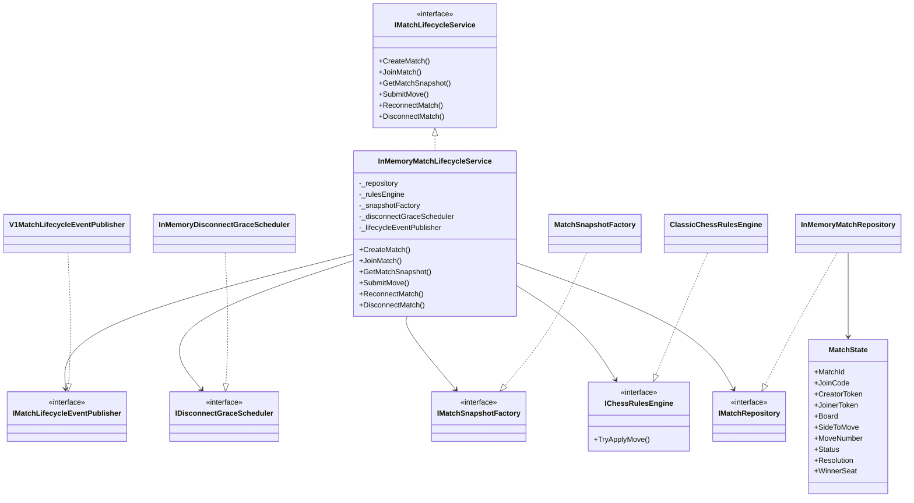

## Server-Regel-Engine

Die serverseitige Regel-Engine `ClassicChessRulesEngine` verwendet die Client-Engine nicht wieder. Stattdessen arbeitet sie direkt auf `MatchState` und auf einer veränderlichen `char[]`-Brettdarstellung, bei der Großbuchstaben weiße Figuren repräsentieren, Kleinbuchstaben schwarze Figuren und `.` ein leeres Feld kennzeichnet. Sie parst algebraische Koordinaten wie `e2` und `e4`, validiert Figurenbewegungen, behandelt Umwandlung, Rochade, En-passant und Königssicherheit und verändert den gegebenen `MatchState` nur dann, wenn der Zug legal ist.

Diese Duplizierung bringt Abwägungen mit sich. Sie bedeutet, dass der Server vollständig unabhängig vom Client-Assembly ist und sich weiterentwickeln kann, ohne eine UI-Abhängigkeit einzuführen. Sie bedeutet aber auch, dass im Repository zwei Schachregel-Implementierungen parallel gepflegt werden müssen. Die Tests auf beiden Seiten reduzieren dieses Risiko, dennoch bleibt es ein architektonisch relevanter Punkt.

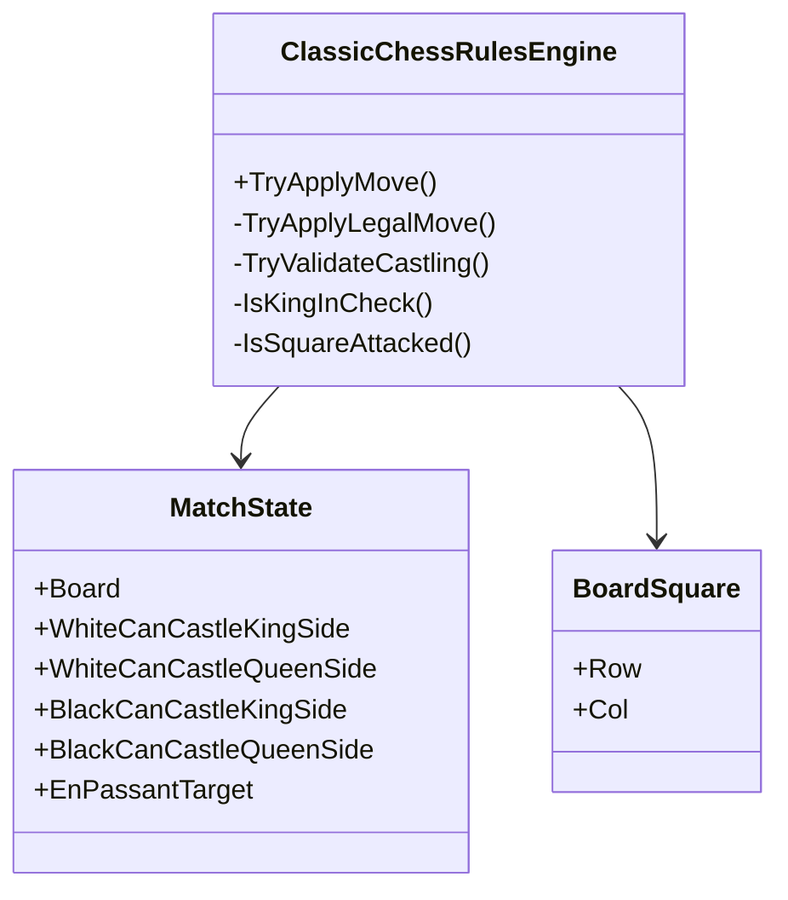

## HTTP-Transportschicht

Die HTTP-API lebt in `Transport/V1/MatchLifecycleEndpoints.cs`. Sie ist bewusst schlank. Jeder Endpunkt delegiert direkt an ein Use-Case-Interface, das von `InMemoryMatchLifecycleService` implementiert wird, übersetzt erfolgreiche Domänenantworten in Contract-DTOs und mappt Fehler über `IMatchErrorHttpMapper`. Der Endpunkt `SubmitMove` hat eine zusätzliche Aufgabe: Nach einem erfolgreichen Zug erwirbt er das Dispatch-Gate für das Match und publiziert ein Echtzeitereignis vom Typ `match updated`, damit verbundene Clients den autoritativen Snapshot erhalten.

Diese Transportschicht bleibt klein, weil die eigentliche Entscheidungshoheit im Application Service verbleibt. Das erleichtert das Testen des Servers. Endpoint-Tests können sich auf Routing, Validierung und Vertragsform konzentrieren, während Match-Lifecycle-Tests das eigentliche Verhalten prüfen.

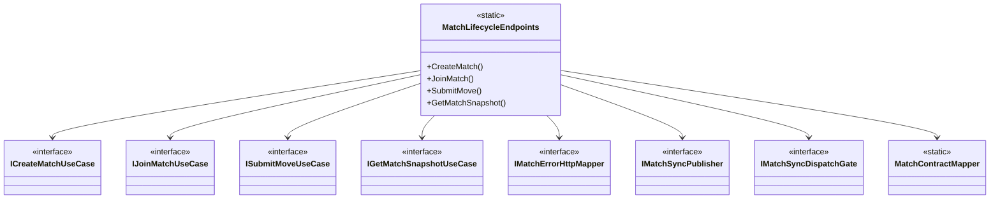

## SignalR-Echtzeitschicht

Die Echtzeitunterstützung für Multiplayer wird durch `MatchHub` und eine kleine Menge Infrastrukturservices darum herum bereitgestellt. Der Hub authentifiziert Verbindungen über `PlayerTokenAuthenticationHandler`, der ein Bearer-Token oder einen `access_token`-Query-Parameter ausliest und daraus einen Claim erstellt. `MatchHub` prüft anschließend, dass das authentifizierte Token mit dem Player-Token übereinstimmt, das in der angeforderten Aktion genannt wird. Diese zusätzliche Prüfung verhindert, dass eine Verbindung das falsche Seat abonniert oder resynchronisiert.

Der Hub ist sorgfältig in Bezug auf Parallelität und Ereignisreihenfolge aufgebaut. `IMatchSyncDispatchGate` stellt pro Match eine asynchrone Sperre bereit, damit Reconnects, Resyncs, Unsubscribe-Operationen und die Veröffentlichung von Zügen nicht falsch ineinanderlaufen. `InMemoryMatchConnectionRegistry` verfolgt, welche Verbindungen welche Matches abonniert haben. `InMemoryMatchSyncSequencer` vergibt monoton steigende Sequenznummern und unterdrückt doppelte Event-IDs, damit Clients Lücken oder Wiederholungen erkennen können. `V1MatchSyncPublisher` sendet Match-Snapshot-, Updated-, PresenceChanged-, Ended- und TransportError-Ereignisse entweder an die gesamte Match-Gruppe oder an eine einzelne Verbindung.

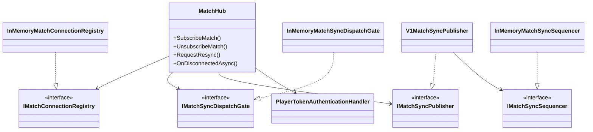

## Grenzen zwischen Speichern, KI und Online-Spiel

Eine der saubereren Designentscheidungen im Client ist die explizite Trennung zwischen lokalem und Online-Modus. Wenn ein Online-Match aktiv ist, behandelt `MainWindowViewModel` die Online-Session als Quelle für die Anzeige und deaktiviert inkompatible lokale Aktionen. Der Persistenzkoordinator blockiert Speichern und Laden. Der Online-Koordinator deaktiviert die KI. Die lokale Spielsession existiert weiterhin, ist aber nicht mehr der sichtbare oder autoritative Zustand, bis die Online-Session endet.

Dadurch bleibt das mentale Modell konsistent. Lokales Spiel wird von `GameSessionService` und der Client-Engine gesteuert. Online-Spiel wird von `OnlineMatchSessionService` und Server-Snapshots gesteuert. Das View-Model ist der Ort, an dem dieser Moduswechsel sichtbar wird, aber die Grenzen werden durch die Koordinator-Klassen erzwungen und nicht durch verstreute `if`-Abfragen im gesamten Code.

## Teststrategie

Das Repository enthält für seine Größe eine vergleichsweise breite Test-Suite. Die Client-Tests decken Brettaufbau, Zugerzeugung, Sonderzüge, Zustandsübergänge, KI-Bewertung, KI-Zugauswahl, Persistenz-Roundtrips, UI-View-Models, Parsing von Figuren-Assets und Online-Session-Koordination ab. Die Server-Tests decken die Regel-Engine, Repository-Verhalten, Lifecycle-Endpunkte, Routen-Konventionen, HTTP-Fehlermapping, Snapshot-Erzeugung, Echtzeittransport-Integration, Disconnect-Policy und Verbindungsverfolgung ab.

Diese Testaufteilung passt zur Architektur. Die am stärksten zustandsbehafteten und korrektheitskritischen Bereiche sind Schachregeln, Session-Zustandsübergänge und Echtzeitsynchronisation, deshalb haben genau diese Bereiche die umfangreichste gezielte Testabdeckung.

## Architektonische Zusammenfassung

Insgesamt verwendet das Projekt explizite Komposition, kleine fokussierte Services und unveränderlichen Client-Zustand, um einen recht breiten Funktionsumfang beherrschbar zu halten. `ChessApplication` ist für lokales Spiel, UI, KI, Speichern und Laden sowie das Verhalten des Online-Clients verantwortlich. `MultiplayerServer` ist für autoritativen Multiplayer-Zustand, Reconnect-Verhalten, Echtzeit-Fan-out und HTTP-Transport verantwortlich. Beide Seiten verwenden absichtlich unterschiedliche interne Schachrepräsentationen. Das hält den Server unabhängig, erfordert aber Disziplin, damit das Regelverhalten auf beiden Seiten konsistent bleibt.

Wenn das Projekt weiter wächst, werden die wahrscheinlichsten architektonischen Druckpunkte die Größe von `MainWindowViewModel`, die Duplizierung zwischen Client- und Server-Regel-Engine und die Lücke zwischen dem reichhaltigen lokalen `GameState`-Modell und dem begrenzteren Online-Snapshot-Modell sein. Trotzdem ist die aktuelle Trennung der Systeme schlüssig, und der Code zeigt bereits klar das Bestreben, Verhalten nach Verantwortlichkeiten statt nach kurzfristiger Bequemlichkeit zu strukturieren.
